Here are a few projects 

## Website Design Capstone Project

> This was my 3rd year capstone project. 
> I spent one semester going through the entire SDLC process of creating a website.
> I was working with a group to deliver a product.

This was my IT capstone project completed in Sem 2 of 2022.
As an assigned group we were tasked with revamping the design of an old Massey
website used for Veterinary students. The old website had so many code errors
so had to make do with what we had in our time frame.

  Whilst doing the project, our group had to efficiently communicate amongst each other.
We would help each other out when required to achieve our common goal.
Additionally, we had weekly sessions with our lecturer/supervisor to report progress.
Here is where we would ask questions about our work and look for guidance.
We successfully used the Agile SDLC method, setting up a GANTT chart for the planing, analysis
implementation and evaluation phases.

In the end we successfully got out our new rendition of the Massey Website with a new look and we received an A grade for our work.
Despite having so many prior code errors we had to make do with what we had
Below are some screenshots of the work. 

| Image | Description                                    
| :--------- | :--------------------------------------- | 
| 1      | The context |
| 2      | Requirements gathering from client |
| 3      | GANNT Chart showing tasks and timeframes |
| 4      | One of the many UML diagrams. This is a Use Case |
| 5      | Our design, still incorporating the infrastructure of the existing site. |

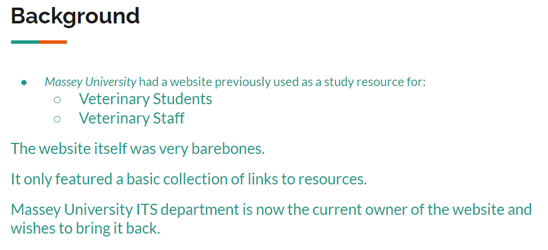
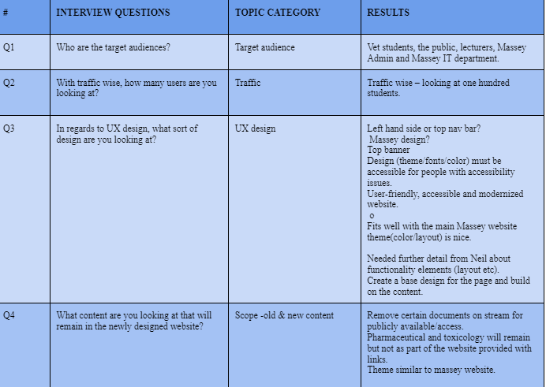
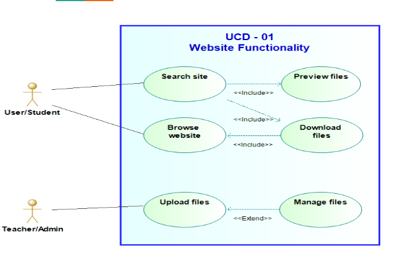
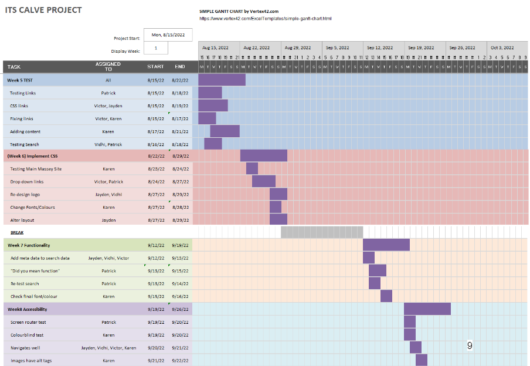

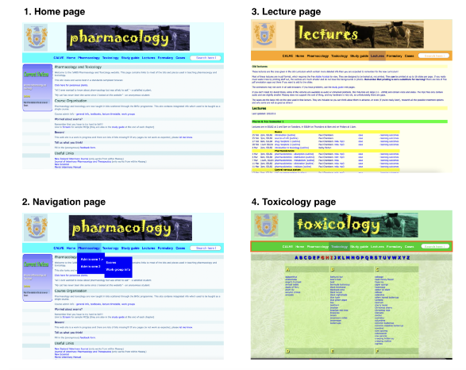

## Django Airliner Website
> This was my advanced web development course's second assignment. Here I used
> the python framework Django in combination with HTML, CSS and deployed with Docker.

The task was to create a faux airliner booking website.
We had quite a lot of freedom in how to go about completing the task.
This included choosing which HTTP python framework we would use. I made the decision to useDjango. I received an A for my work.

| Image | Description                                    
| :--------- | :--------------------------------------- | 
| 1      | The home page |
| 2      | The flights page header |
| 3      | The flight map and scrolling down are dates |
| 4      | After clicking a flight link, page to book it appears |
| 5      | After selecting desired flight, if successful this appears |
| 6      | A Django users function register. Successfully add the user to the Users tab to    then login. This allows user to sign in and make bookings. |

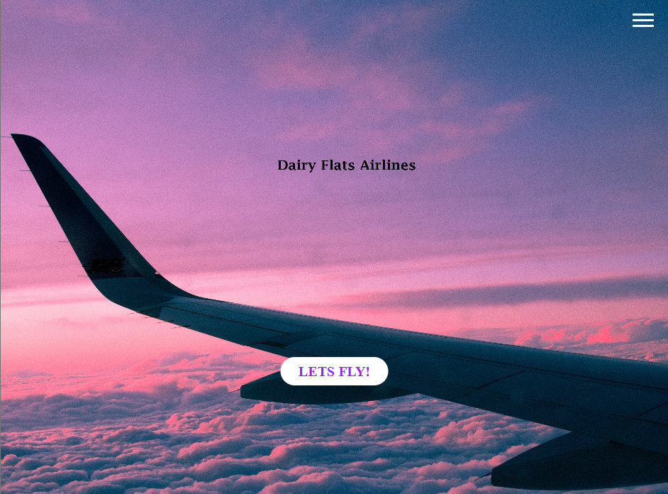
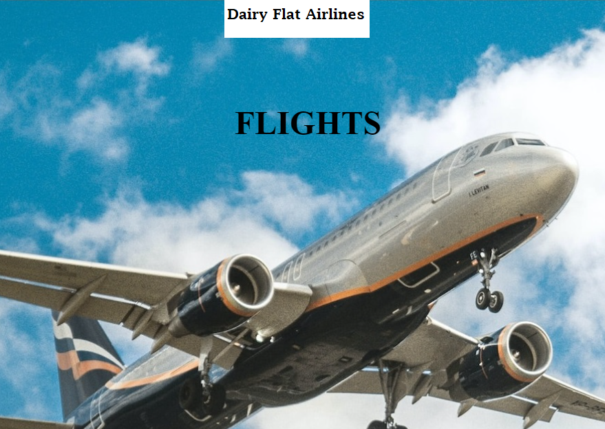

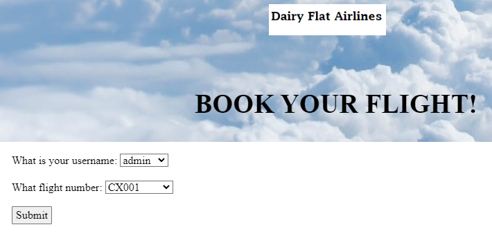
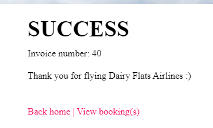
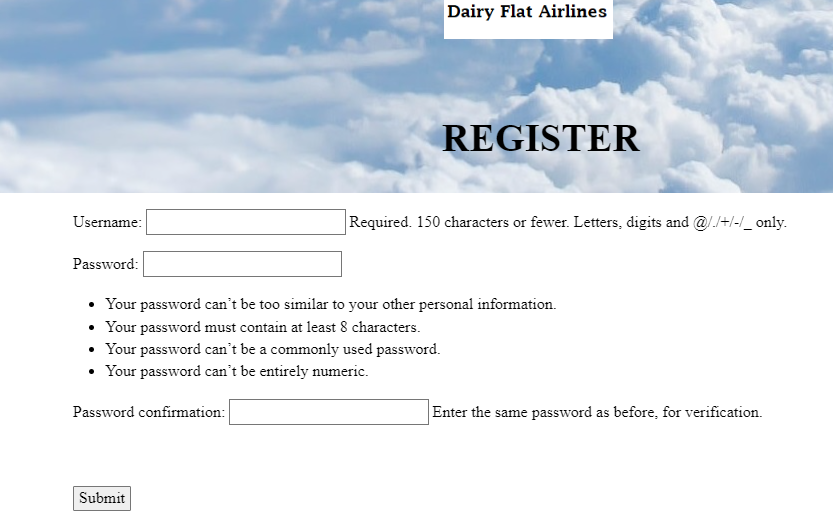

## Python Psychological Profile

> 1. This was an assignment for my advanced web development course.
> I made a psychological profile generator

The task was to create a psychological portfolio for the user.
The user would fill out a form, including radio buttons and some multi-choice.
Based off that the Python program would determine if they were a good fit for
their dream job. Additionally, it would display their favourite animal and suggest a movie. I received an A+ for my work

| Image | Description                                    
| :--------- | :--------------------------------------------------------- | 
| 1      | Home page, showing buttons to press. |
| 2      | After clicking "Go to form, a new window opens with the form. |
| 3      | The rest of the form showing different question styles. |
| 4      | After submitting the form, returning to home page Load Data is now loaded withJSON data to display. Shows answers in plain text. |
| 5      | Using an API a random image is selected from a database of animal images. Here a random image is called and displayed depending on what animal was ticked in the form. |
| 6      | Based on the form, a movie is also suggested. |

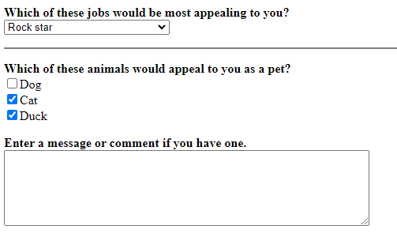
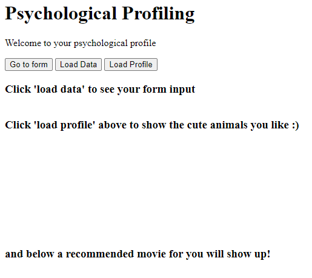

## This website!

I had previously created a website version of my CV in HTML and CSS but it wasn't satisying my need for more
knowledge. Neither was it fully showcasing my learning capability and skills.

Hence, I applied myself to learn a completely new language which is Gatsby!

Gatsby is a far more complex language than HTML is. It uses react.js and a web of configuring files to produce
the front-end website you see here. 

I hope you like it :)
