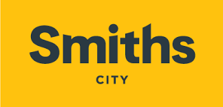
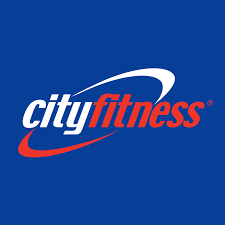

Where I have gained valuable life and work experience to further my career.

## Retail Professional
### Smith's City, Palmerston North, Manawatu

2023-12 - Current

- Sales IT systems.
- Endless customer service.
- IT troubleshooting for both colleagues and customers.

## Gym Receptionist
### City Fitness, Palmerston North, Manawatu

2022-09 - Current
- Actively contributes ideas and always happy to help when needed.
- Kept front desk and lobby clean, clutter-free, and orderly to present attractive atmosphere.
- Recorded equipment, facility, and janitorial issues to facilitate maintenance.
- Referred unresolved customer issues to management for further investigation.
- Monitored check-ins to identify delinquent accounts and collect payments.
- Drove revenue by communicating and demonstrating benefits of products and special promotions to customers.
        

### Appen, machine intelligence company (Online)
#### Data Collection

- AI teaching with voice recognition and recordings.
- Completed two contributions to different AI companies.
- Contributed data for their research.

### Referees
       Terry Hong Manager 0211038423
       Lee Radich Manager 0220661533 lee.radich@cityfitness.co.nz

