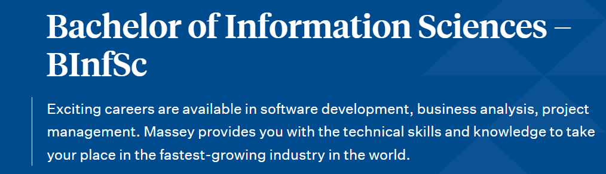
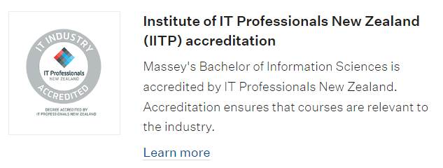
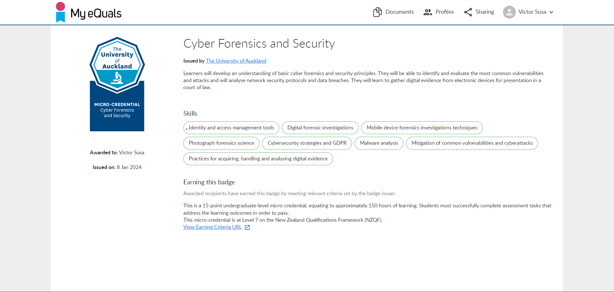
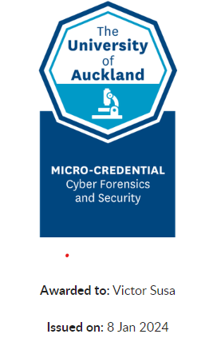

I have studied for the past 3 and a half years. Below are my qualifications

## Bachelor of Information Sciences
### Massey University - Palmerston North

 February 2020 - June 2023

>Successful completion to a high standard of the Bachelor of Information Sciences in June 2023.

## Micro-credential
### University of Auckland
 September 2023 - December 2023
> Completed post-graduate micro-credential in Cyber Forensics and Security (Online). A+ Grade.

## ITP NZ Member

> I am part of the NZ organisation IT Professionals. Where I keep up with IT in the country. Follow worldwide technological advances.

## Passions

During my sudies I took a liking to these fields in particular:

1. Cyber Security
2. Website Creation
3. Statistics and Data Analysis
4. Networks
5. Customer Service
Personal hobby to study new tech products and how they work